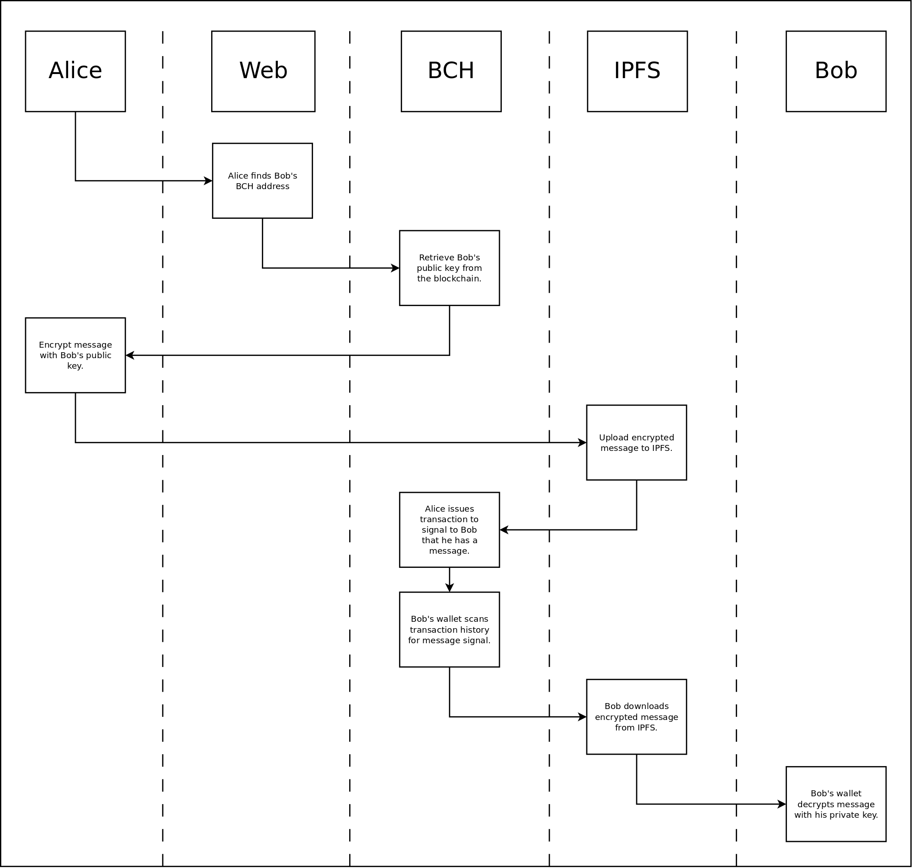

# Media Sharing Protocol Specification
## Permissionless Software Foundation Specification 001 (PS001)

### Specification version: 1.0.2
### Date originally published: May 30, 2020
### Date last updated: November 10, 2020

## Authors
Chris Troutner

## Acknowledgements
- James Cramer created the [Bitcoin Files Specification](https://github.com/simpleledger/slp-specifications/blob/master/bitcoinfiles.md) leveraged by this document.
- The [Memo Protocol](https://memo.cash/protocol) used by [Memo.cash](https://memo.cash) is used here as the base protocol.

## 1. Introduction
The following presents a simple protocol for sharing files both on-chain and off-chain with people using a Bitcoin Cash address as an identity. This specification defines a system that functions very much like email, using Bitcoin Cash addresses in place of an email address. It defines how to pass arbitrary messages and files of any size to the recipient. This content can be end-to-end (e2e) encrypted with the recipients public key, which means only the person holding the private key for that Bitcoin Cash address can decrypt the content.

For very small content (less than 10kB), on-chain data can be transmitted via the [Bitcoin Files Protocol](https://github.com/simpleledger/slp-specifications/blob/master/bitcoinfiles.md). Content of any size can be shared off-chain via the [Inter-Planetary File System](https://ipfs.io) (IPFS).

## 2. Protocol

This protocol specification describes the requirements for signaling to a Bitcoin Cash address that another address has sent it a message and how to retrieve the message.

### 2.1 Payload Information
The OP_RETURN of a Bitcoin Cash transaction is used to point to the message payload, and to indicate if that content is stored on-chain or off-chain. This data extends the [Memo Protocol](https://memo.cash/protocol), by using the `0x6dd2` prefix to signal a UTF-8 encoded (aka 'clear text') message using the memo protocol.

The message follows this pattern:

- `MSG <medium> <pointer> <subject>`

For example, here is a message indicating an off-chain message using IPFS as the content-delivery medium:

- `MSG IPFS QmT17Px3WcydqbZnKGUkKb5tWTM7Ypoz1UJ1MHWngC49xQ A message for you`

The *medium* above is specified as IPFS. The *pointer* is the IPFS hash needed to retrieve the content from the IPFS network. The rest of the signal is a *subject* message, similar to an email subject. The subject can be of any length, as long as it fits within the constraints of the OP_RETURN.

Here is another example indicating an on-chain message using the [Bitcoin Files Protocol](https://github.com/simpleledger/slp-specifications/blob/master/bitcoinfiles.md) protocol:

- `MSG BFP bitcoinfile:2f2add68a365da4cae325e4d4a0f6a57ddffd3446a6dc3bf5b32f6ae9f0f48ff Another subject message`

### 2.2 Message Signaling

An on-chain signal is required to allow wallets to detect that they have a message waiting for them. In addition to the data in the OP_RETURN, a dust output is sent to the recipients address. This will cause the transaction to appear in the transaction history for the address. Wallets can easily crawl their transaction history to find transactions with the above OP_RETURN payload.

- [Here is an example of a transaction on the block explorer](https://explorer.bitcoin.com/bch/tx/65395fe21e1add6bfb249f6ad108834734b0f71379b67a222f4144cbb39dfa32). The recipient is bitcoincash:qzxk8ecxm6drkcjtkrepesx5dd45fsvjauvxeeynfy.

### 2.3 Spam Prevention

The on-chain signal to the recipient is a standard dust output (546 satoshis). But it is not required to be dust. It can be any amount of satoshis more than dust.

If a threshold amount of satoshis is set by the end user, this feature can be used as spam prevention. Any messages not meeting the threshold can be ignored by the wallet.

## 3. Encryption

The protocol can be used with or without encryption. However, the Bitcoin protocol naturally allows for end-to-end (e2e) encryption to be implemented, far easier than is currently done in email. Bitcoin payments naturally use Eliptic Curve cryptography. This aspect of the Bitcoin protocol can be leveraged to encrypt the content of messages as well.

### 3.1 Public Keys

In email, recipients must provide the sender with their public key. The sender then encrypts the message with that public key before sending the message. This key passing is a large source of friction and largely explains why attempts to implement widespread encryption in email has been a failed effort. Key servers are available to reduce this friction, but they require additional training by the users.

Any time a Bitcoin Cash address **sends** money, their public key is recorded on the blockchain. This is a core, primitive part of the Bitcoin protocol. This key can be retrieved by the sender *without any need for communication with the recipient*. This eliminates the source of friction experienced in the email use-case.

However, unless the recipient has initiated **at least one transaction**, their public key will not exist on the blockchain and it can not be retrieved. This is an important initialization step that wallets implementing this specification need to be aware of.

## 4. Implementation
There have been multiple implementations of this specification as this idea has evolved over time. The list below are presented in reverse-chronological order, so newest first.

- [encrypt-msg](https://github.com/Permissionless-Software-Foundation/encrypt-msg) is a command line application that implements the full specification in this document.
- [memo-push](https://github.com/christroutner/memo-push) is another command line application that can write IPFS hashes to the BCH blockchain.
- [Uncensorable Publishing](https://uncensorablepublishing.com/) was an early implementation of this specification for publishing websites. It leverages IPFS and the memo-push command line app.

## Appendix 1
### Message Encryption and Delivery Workflow

- [Dia diagram file](./images/e2e-pt2-flow.dia)

This diagram shows the workflow associated with 'Alice' to send an e2e encrypted message to 'Bob' using the encrypt-msg app. This diagram is covered in detail in [this YouTube video](https://www.youtube.com/watch?v=RB9yt65y9s8).

## Appendix 2
### Extending the Existing Protocols

This specification uses the OP_RETURN prefix `0x6dd2`. This choice is a result of collaboration with the developers behind [memo.cash](https://memo.cash) and [member.cash](https://member.cash), two on-chain social media applications.

The `0x6dd2` prefix was previously unused, and it extends the existing specifcation for each social media platform:

- [memo.cash Protocol Specification](https://memo.cash/protocol)
- [member.cash Protocol Specification](https://github.com/memberapp/protocol)
